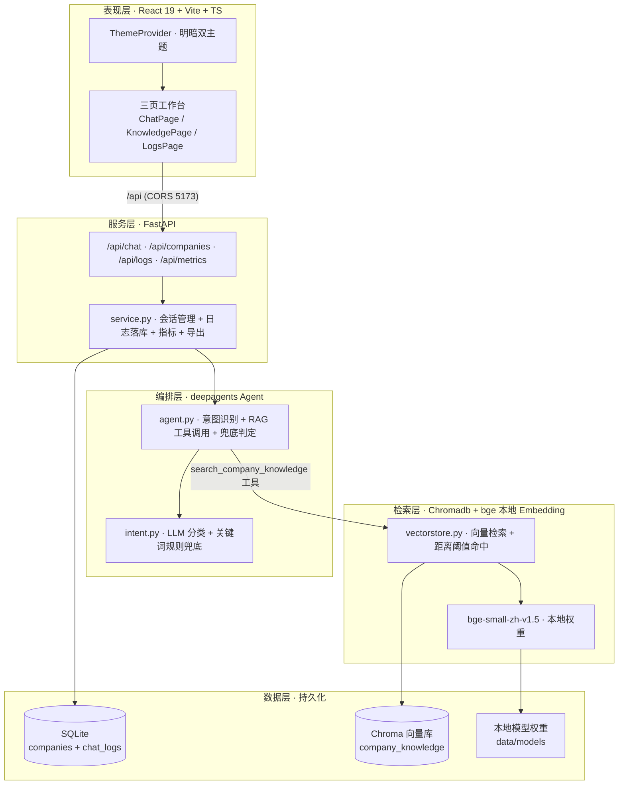
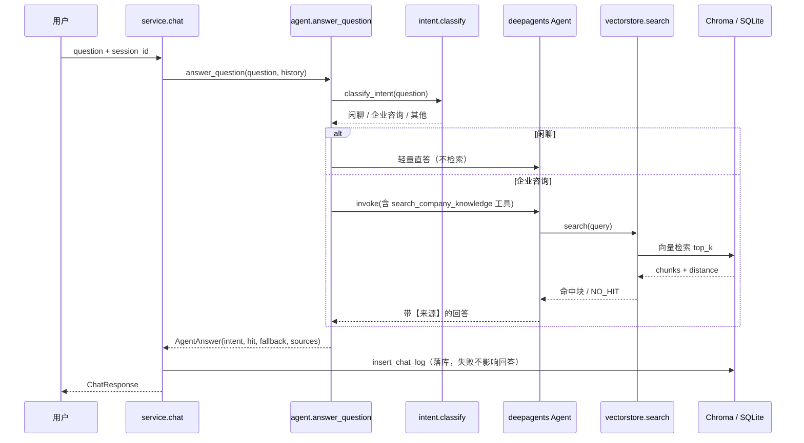

# 知企智答 · 企业智能客服 Agent 系统

> 面向「介绍中国互联网公司」场景的 RAG 智能客服 Agent。基于 **deepagents**（LangChain 官方 Agent Harness，底层 LangGraph）编排，配套 FastAPI 服务层、Chromadb 向量检索与 React 19 三页工作台。
>
> 项目定位：对外产品演示 / 大模型 Agent 方向求职作品集，展示 **RAG 编排、意图识别、可观测日志、明暗双主题前端** 的真实工程能力。

---

## ✨ 核心特性

- **检索增强问答（RAG）**：问题 → 意图识别 → 知识库向量检索 → 组织回答 + 来源引用，禁止编造库外事实。
- **客观命中判定**：命中 / 兜底由向量检索的 cosine 距离阈值（`RETRIEVAL_MAX_DISTANCE`）客观判定，不依赖模型自述，可审计、可统计。
- **意图识别 + 兜底**：自动区分「闲聊 / 企业咨询 / 其他」，闲聊轻量直答不检索，库外问题返回固定兜底话术并标注。
- **多轮上下文**：内存维护最近 6 轮会话，支持代词指代（如「它的云计算业务呢？」）。
- **三页工作台**（明暗双主题）：
  - **对话页**：多轮对话、快捷问题、内联知识来源引用、意图 / 命中 / 兜底 / 耗时徽章。
  - **知识库管理**：企业条目录入、行业 / 状态筛选、统计概览、增删即触发索引重建。
  - **日志审查**：会话列表、命中率 / 兜底率等指标、意图与命中标签、CSV / JSON 导出。
- **零信任密钥**：所有 API Key 走 `.env` 环境变量，不入库、不硬编码。
- **免费模型优先**：默认 `sensenova-6.7-flash-lite`，失败自动回退 `deepseek-v4-flash`。

---

## 🏗️ 系统架构

### 五层架构



### 单轮 RAG 数据流



> 命中 / 兜底判定逻辑：`RetrievedChunk.hit = distance <= RETRIEVAL_MAX_DISTANCE`；若本轮检索无任何命中块，则 `fallback = true`，返回固定兜底话术。判定完全基于检索距离，与模型输出解耦，保证统计可信。

更详细的模块职责与数据契约见 [`docs/architecture.md`](./docs/architecture.md)。

---

## 📁 目录结构

```
agent-server/
├── src/zhiqu/                 # 后端（Python 3.13, uv 管理）
│   ├── config.py             # 路径 / 模型端点 / 检索参数（密钥走 env）
│   ├── db.py                 # SQLite 数据层（companies + chat_logs）
│   ├── seed.py               # 4 家种子企业（幂等 upsert）
│   ├── vectorstore.py        # Chromadb 检索 + 距离阈值命中判定
│   ├── intent.py             # 意图分类（LLM + 关键词规则兜底）
│   ├── agent.py              # deepagents 编排 + RAG 工具 + 兜底
│   ├── service.py            # 会话管理 + 日志落库 + 指标 + 导出
│   └── api.py                # FastAPI 路由 + 前端静态托管
├── web/                      # 前端（React 19 + Vite 7 + TS + Tailwind v4）
│   ├── src/
│   │   ├── api.ts            # 强类型 API 客户端
│   │   ├── theme.tsx         # 明暗主题（localStorage 持久化）
│   │   ├── ui.tsx            # Badge / Card / StatCard / Button
│   │   ├── pages/            # ChatPage / KnowledgePage / LogsPage
│   │   └── App.tsx           # 侧栏导航 + 三页路由
│   └── dist/                 # 构建产物（uvicorn 自动托管）
├── scripts/                  # 验证脚本（M2~M4 里程碑）
│   ├── demo_cli.py           # 单轮 RAG 验证
│   ├── demo_m3.py            # 意图 / 兜底 / 多轮
│   └── demo_m4.py            # 日志 / 指标 / 导出
├── data/                     # 运行时数据（已在 .gitignore）
│   ├── models/bge-small-zh-v1.5/   # 本地 embedding 权重
│   ├── chroma/               # 向量库
│   ├── exports/              # 日志导出
│   └── zhiqu.db              # SQLite
├── .env / .env.example       # 环境变量（密钥零信任）
├── pyproject.toml            # Python 依赖（uv）
├── uv.lock
└── README.md
```

---

## 🔧 环境要求

| 组件 | 版本 |
| --- | --- |
| Python | ≥ 3.13（项目用 `uv` 管理虚拟环境） |
| Node.js | ≥ 22（前端用 `pnpm` 包管理） |
| 包管理器 | `uv` + `pnpm` |

> Windows 用户建议在 **Git Bash / WSL** 下执行 bash 命令；PowerShell 等价命令在文中一并给出。

---

## 🚀 安装与启动

### 1. 安装依赖

```bash
# Python 依赖（自动创建 .venv）
uv sync

# Node 依赖（进入 web 目录）
cd web && pnpm install && cd ..
```

### 2. 配置环境变量

复制模板并填入你的 `SENSENOVA_API_KEY`（商汤日日新免费额度）：

```bash
cp .env.example .env
# 编辑 .env：SENSENOVA_API_KEY=你的密钥
```

`.env` 内容示例：

```env
SENSENOVA_API_KEY=your-sensenova-api-key
SENSENOVA_BASE_URL=https://token.sensenova.cn/v1
# 可选：RETRIEVAL_MAX_DISTANCE=0.45
```

> 密钥零信任：`.env` 已加入 `.gitignore`，绝不入库。embedding 权重默认使用项目内 `data/models/bge-small-zh-v1.5`（离线可用），无需外网下载。

### 3. 启动

#### 方式 A · 开发模式（前后端分离，热更新）

```bash
# 终端 1：启动后端
uv run uvicorn zhiqu.api:app --app-dir src --host 127.0.0.1 --port 8720

# 终端 2：启动前端（Vite 代理 /api → 127.0.0.1:8720）
cd web && pnpm dev
```

前端访问 **http://localhost:5173**。

#### 方式 B · 生产模式（单端口，uvicorn 托管前端）

已构建 `web/dist`（若未构建先 `cd web && pnpm build`），直接启动后端即可：

```bash
uv run uvicorn zhiqu.api:app --app-dir src --host 127.0.0.1 --port 8720
```

访问 **http://127.0.0.1:8720** 即三页工作台（含 API）。

#### 一键启动脚本

```bash
bash scripts/start.sh      # 同时拉起前后端（开发模式）
```

> PowerShell 等价：分别在两个终端执行方式 A 的两个命令即可。

---

## 🔌 API 速查

| 方法 | 路径 | 说明 |
| --- | --- | --- |
| POST | `/api/chat` | 对话：`{question, session_id?}` → 含 `intent/hit/fallback/sources/model/latency_ms` |
| POST | `/api/chat/{session_id}/reset` | 清空指定会话内存上下文 |
| GET | `/api/companies?industry=&status=` | 企业列表（可按行业 / 状态筛选） |
| POST | `/api/companies` | 新增 / 更新企业条目（自动重建索引） |
| DELETE | `/api/companies/{id}` | 删除企业条目（自动重建索引） |
| GET | `/api/companies/stats` | 知识库统计（总数 / 已发布 / 审核中 / 行业分布） |
| GET | `/api/logs?session_id=&limit=` | 对话日志列表 |
| GET | `/api/metrics` | 指标：总会话 / 总轮次 / 命中率 / 兜底率 / 平均轮次 |
| GET | `/api/logs/export?fmt=csv\|json` | 导出全部日志（CSV 用 `utf-8-sig` 防乱码） |

**对话请求示例：**

```bash
curl -X POST http://127.0.0.1:8720/api/chat \
  -H "Content-Type: application/json" \
  -d '{"question":"腾讯的主营业务有哪些？"}'
```

> 注：命令行 `curl` 发送中文 JSON 建议用文件或 Python 客户端，避免终端编码问题。

---

## 📊 知识库与演示

- **种子数据**：首次启动自动写入 4 家中国互联网公司（腾讯控股、阿里巴巴集团、字节跳动、百度），含简介 + 主营业务知识文本。
- **知识库后台**：可在「知识库」页录入新企业（状态「已发布」才会进入检索索引）；增删后索引自动重建。
- **效果演示**：在「对话」页试问：
  - 「腾讯的主营业务有哪些？」（命中 → 带来源引用）
  - 「字节跳动上市了吗？」（命中 → 来源字节跳动）
  - 「你好」（闲聊 → 轻量直答不检索）
  - 「茅台股价多少？」（库外 → 兜底话术）
  - 「它的云计算业务呢？」（多轮代词指代）
- **日志审查**：在「日志」页查看命中率 / 兜底率等指标，并导出 CSV / JSON 复盘。

---

## 🧪 验证脚本

里程碑验证脚本（需先启动后端）：

```bash
uv run python scripts/demo_cli.py   # M2：单轮 RAG
uv run python scripts/demo_m3.py    # M3：意图 / 兜底 / 多轮
uv run python scripts/demo_m4.py    # M4：日志 / 指标 / 导出
```

---

## 🛠️ 技术栈

| 层级 | 技术 |
| --- | --- |
| 编排 | `deepagents==0.6.0`（LangChain 官方，底层 LangGraph） |
| LLM | `sensenova-6.7-flash-lite` → `deepseek-v4-flash`（OpenAI 兼容，失败回退） |
| Embedding | `bge-small-zh-v1.5`（本地权重，query 侧加指令前缀） |
| 向量库 | `chromadb`（cosine 距离，持久化） |
| 服务 | `fastapi` + `uvicorn` |
| 数据 | `sqlite`（companies + chat_logs 双层） |
| 前端 | `react 19` + `vite 7` + `typescript 5.8`（strict）+ `tailwindcss v4` |

---

## ❓ 常见问题

- **启动报 `缺少 SENSENOVA_API_KEY`**：未配置 `.env`，请按「配置环境变量」步骤填写密钥。
- **首启较慢（约 30s）**：需加载本地 bge embedding 模型，属正常。
- **前端白屏 / 接口 404**：确认后端已在 8720 运行；开发模式确保前端走 5173（Vite 代理）。
- **新增企业后仍检索不到**：确认状态为「已发布」（仅已发布进入索引）；后台增删会自动 `rebuild_index`。
- **中文 `curl` 解析失败**：改用文件体或 Python 客户端发送中文 JSON。

---

## 📄 许可证

本项目用于演示与学习，种子企业数据来自公开资料整理，仅供示例。
